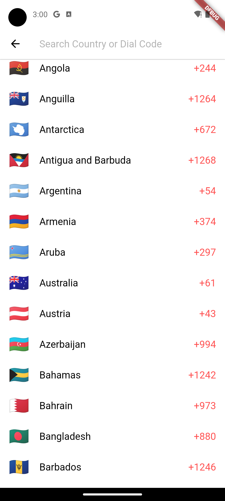
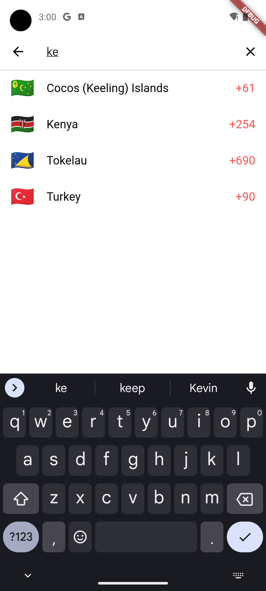

# CountryDialCodePicker

DialCodePicker package streamline your app's user registration with ease! Our Flutter package empowers developers to effortlessly integrate a country dial code picker, enhancing the user experience and simplifying the input of phone numbers. Elevate your registration process with just a few lines of code.

## Using

```dart
DialCodePicker.pickCountry(
    context: context,
    accentColor: Colors.redAccent,
    backgroundColor: Colors.white,
    textColor: Colors.black,
    fontSize: 18,
);
```

## Screenshots




## Contributing

Contributions are welcome! If you encounter any issues or have suggestions for improvements, please open an issue or submit a pull request.
